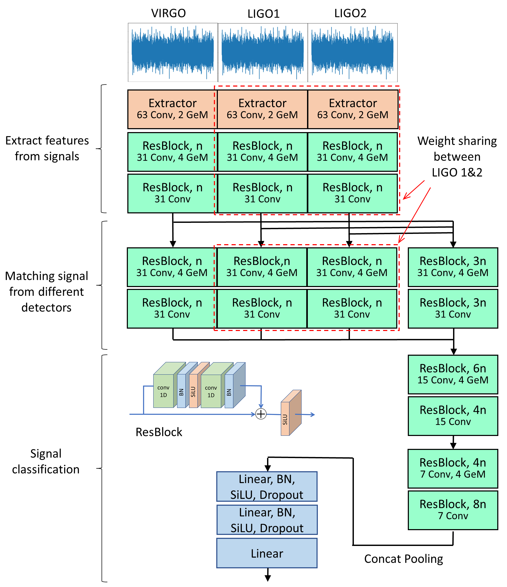
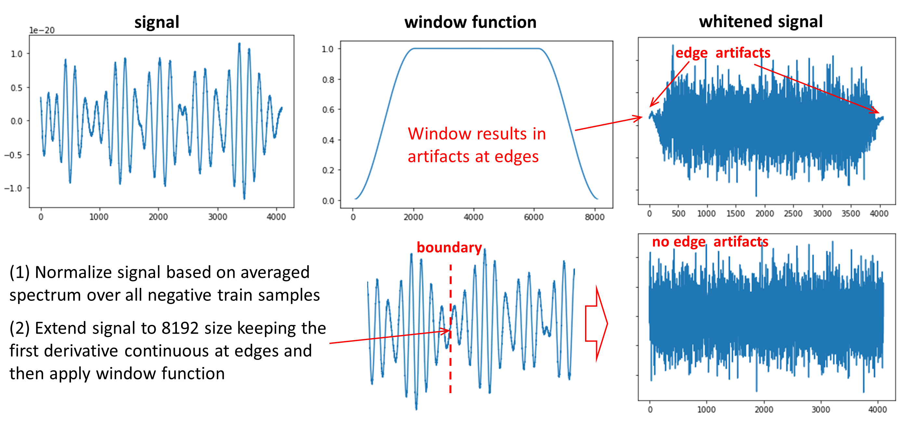

# G2Net-Gravitation-Wave-Detection 3rd Place Solution
### TL;DR

##### Models we used in our best submission: 15 1D Model + 8 2D Model

**2D Models** [best single model: **0.87875/0.8805/0.8787** at CV, public, and private LB]

- CQT, CWT Transformation
- Efficientnet, Resnext, InceptionV3…
- TTA: shuffle LIGO channel

**1D Models** [best single model: **0.8819/0.8827/0.8820** at CV, public, and private LB]

- Customized architecture targeted at GW detection
- augmentation and TTA: vflip, shuffle LIGO channels, Gaussian noise, time shift, time mask, MC dropout

**Training:**

- Pretraining with GW
- Training with Pseudo Label or Soft Label
- BCE, Rank Loss
- MixUp
- AdamW, RangerLars+Lookahead optimizer

**Preprocessing:**

- Avg PSD of target 0 (Design Curves)
- Extending waves
- Whitening with Tukey window

**GW Simulation**

- Distribution of Total Mass
- SNR injection ratio max(N(3.6,1),1)

**Ensemble**

- CMA-ES Optimization
- Hacking Private LB

### Details

#### 2D Models

Like many of the participants, our team initially focused on 2D models. Among the various approaches we tried, we found that whitened signals, which we will discuss later, was the most effective preprocessing for signals. We created the following 2D models using the CQT and CWT images generated from the whitened signal as input.

We also tried various augmentations for 2D images (mixup, cutout, …), but most of them did not work here, however mixup on the input waveform prior to CQT/CWT did help counteract overfitting. The most effective one was the augmentation of swapping LIGO signals. This worked both for training and inference (TTA, Test Time Augmentation) and we found soft pseudo labeling also improved the score.

The performance of our best single 2D model is **0.87875/0.8805/0.8787** at CV, public, and private LB.

- EfficientNet(B3, B4, B5, B7), EfficientNetV2(M), ResNet200D, Inception-V3 (also we performed a number of initial experiments with ResNeXt models)
- CQT and CWT images generated based on the whitened signal
- Image size 128 x 128 〜 512 x 512
- Soft leak-free pseudo labeling from ensemble results
- LIGO channel swap argumentation (randomly swapping LIGO channels) for both training and TTA
- 1D mixup prior to CQT/CWT
- Adding a 4th channel to the spectrogram/scalogram input which is just a linear gradient (-1, 1) along the frequency dimension used for frequency encoding (similar to positional encoding in transformers)

#### 1D Models

1D models appeared to be the key component of our solution, even if we didn't make great improvement until the last 1.5 weeks of the competition. The reason why these models were not widely explored by most of the participants may be the need of using signal whitening to reach a performance comparable with 2D models (at least easily), and whitening is not straightforward for 2s long signals (see discussion below). However, 1D models are much faster to train, and they also outperform our 2D setup. The performance of our best single 1D model is **0.8819/0.8827/0.8820** at CV, public, and private LB. So **it can reach top-7 LB after ~8 hours of training**.

One of the main contributions towards this result is the proper choice of the model architecture for GW detection task. Specifically, **GW is not just a signal of the specific shape, but rather a correlation in signal between multiple detectors**. Meanwhile, signals may be shifted by up to ~10-20 ms because of the time needed for the signal to cross the distance between detectors. So direct concatenation of signals into (3,4096) stack and then applying a joined convolution is not a good idea (our baseline V0 architecture with CV of 0.8768). Random shift between components prohibits the generation of joined features. Thus, we asked the question, why not split the network into branches for different detectors, like proposed in [this paper](https://www.sciencedirect.com/science/article/pii/S0370269320308327)? So the first layers, extractor and following Res blocks, learn how to extract features from a signal, a kind of learnable FFT or wavelet transform. So before merging the signals the network already has a basic understanding of what is going on. We also share weights between LIGO1 and LIGO2 branches because the signals are very similar.

Merge of the extracted features instead of the original signal mitigates the effect of the relative shift (like in Short Time Fourier Transform correlation turns into a product of two aligned cells). So simple concatenation at this stage (instead of early concatenation) followed by several Res blocks (V1 architecture) gives an improvement from **0.8768 to 0.8789**. However, the model after combining the signal and getting a better idea about GW, may still want to look into individual branches as a reference. So we extend our individual branches and perform the second concatenation at the next convolutional block (V2 architecture). It results in a further improvement of CV to **0.8804**.

After the basic structure of the V2 model was defined, we performed a number of additional experiments for further model optimization. The model architecture tricks giving further improvement include the use of SiLU instead of ReLU, use of GeM instead of strided convolution, use of concatenation pooling at the end of the convolutional part. In one of our final runs, we used ResNeSt blocks (Split Attention convolution) having a comparable performance in the preliminary experiments, but it also performed slightly worse at the end of full training. Using CBAM modules and Stochastic Depth modules gave a slight boost and made the 1D models more diversified. The network width, n, is equal to 16 and 32 for our final models. One of our experiments is also performed for a combined 1D+2D models, pretrained separately and then finetuned jointly, which gave 0.8815/0.8831/0.8817 score.

**Things that didn’t work:** use of larger network depth (extra Res blocks), use of smaller/larger conv size in the extractor/first blocks, use of multi-head self-attention blocks before pooling or in the last stages of ResBlocks (i.e. Bottleneck Transformers), use of densely connected or ResNeXt blocks instead of ReBlocks, learnable CWT like extractors (FFT->multiplication by learnable weights->iFFT), WaveNet like network structures, pretrained ViT following the extractors (instead of customized resnet).

##### Training (1D models)

- Pretraining with Simulated GW for 2~4 epochs (**2-8bps** boost)
- Training with Pseudo-labeling data for 4~6 epochs depending on the model
- Training with rank loss and low lr for 2 epoch (**~1bps** performance boost)

TTA based on multiplying the signal by -1 and first/second channel swap gave **~2bps** boost. 64 fold MC dropout gave an additional **~1bps** boost. Also during training in some experiments we used 0.05 spectral dropout: drop the given percentage of FFT spectrum during whitening.

### Preprocessing

Regarding whitening, direct use of packages, such as pycbc, doesn’t work mainly because of the short duration of the provided signals: only 2 seconds chunks in contrast to the almost unlimited length of data from LIGO/VIRGO detectors. To make the estimated PSD smooth, pycbc package uses an algorithm that corrupts the boundary of data, which is too costly for our dataset, whose duration of signals is only 2 seconds. We reduce the variance of estimated PSD by taking the average PSD for all negative training samples. This is the key to make whitening work (interestingly, this averaging idea came up independently to two of the team members). To further reduce the boundary effect from discontinuity and allow ourselves to use a window function that has a larger decay area (for example, Tukey window with a larger alpha), we first **extend the wave while keeping the first derivative continuous at boundaries**. Finally, we apply the window function to each data and **use the average PSD to normalize the wave for different frequencies**.

**For 1D model:**

- Extend the signal to (3,8192)
- Tukey window with alpha 0.5
- Whitening with PSD based on the average FFT of all negative training examples

**For 2D model:**

- Using the whiten data and apply CQT transform with the following parameters:
- CQT1992v2(sr=2048, fmin=20, fmax=1000, window='flattop', bins_per_octave=48, filter_scale=0.25, hop_length=8)
- Resize (128x128, 256x256 …. )

### GW Simulation

This idea is coming from curriculum learning, and in [this paper](https://arxiv.org/abs/2106.03741), it mentioned that “We find that the deep learning algorithms can generalize **low signal-to-noise ratio (SNR) signals to high SNR ones but not vice versa**”, so we follow it and try to generate a signal and inject into the noise with low SNR. Even though there are around 15 parameters, we found that the most important one is the total mass and mass ratio (maybe we are wrong) because it affects the shape of GW the most through eyeballing. So we adjust the total mass and mass ratio using different distributions and inject the signal into the noise with a given SNR following max(random.gauss(3.6,1),1) distribution. This SNR distribution is determined by checking the training loss trend: we want it to follow the trend of original data (not too hard, not too simple). This way gives us a **2~8bps increase** depending on the model we use.
We also tried to follow this idea by giving Hard Positive samples from the train data more weight but due to the time constraints, we didn’t make it work. It could be a potential win here.

### Ensemble

First, to confirm that train and test data are similar and do not have any hidden peculiarities we used **adversarial validation** that gave 0.5 AUC = train and test data are indistinguishable.

We tried many different methods to ensemble the models and saw the following relative performance trend: [CME-ES](https://github.com/CMA-ES/pycma) with Logit > CME-ES with rank> Scipy Optimization > Neural Network > other methods. We also tried to use `sklearn.preprocessing.PolynomialFeatures` with probability prediction to do the CME-ES optimization. It brings the highest CV and LB but with a little chance of overfitting. We are glad that it turns out to be our best 0.8829 submission.

Our second submission is based on a simulation of the private LB by excluding 16% of our OOF data out of CV optimization. So the produced model weights are more robust to the data noise and potentially can lead to a better performance at the private LB. We do this because we found the CV and LB correlation is very high and we also used adversarial validation to check that indeed test and train dataset are similar. So We bootstrapped 16% OOF data which has a similar CV to public LB score and **the optimized CV for the remaining data matched the same as the private LB (0.8828 for one of our submissions)**.

### Acknowledgment

Some of the team members used JarvisLabs.ai for their GPU workstations. The cloud platform is easy to use, stable, and very affordable. The pause functionality is great. Recommend this platform to Kagglers.

